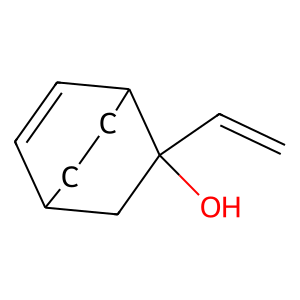
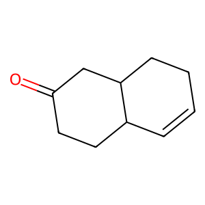

# Morpheus


Automatic calculation of $\Delta G$ for arbitrary chemical reactions
## Requirements
### Python
This depends heavily on [rdkit](https://www.rdkit.org/docs/). 
### External dependencies
This application requires `xtb` to be installed on your system. 
Information on the installation process can be found here: [xtb](https://xtb-docs.readthedocs.io/en/latest/setup.html)

check your xtb version using
```bash
xtb --version
```

If you want to use `crest` for optimizing conformers, `crest` has to be installed on your system. 
This can be installed following the instructions here: [crest](https://crest-lab.github.io/crest-docs/page/installation)

check your crest version using
```bash
crest --version
```

This application was developed for:
- xtb version 6.7.0
- crest version 3.0.1
- rdkit version 2024.03.3

## Installation
`morpheus` will be available through pip. To install run:
```pip
pip install morpheus
```
## Usage
Morpheus supports usage through the cli or the python library:
### CLI
```
usage: morpheus [-h] [-s SMILES [SMILES ...]] [-sf SMILES_FILES [SMILES_FILES ...]] [-cs] [-o OUTPUT] [-csm CONFORMER_SEARCH_METHOD] [-csl CONFORMER_SEARCH_LEVEL] [-gfn {0,1,2}] [-p PROCESSORS]
                [-xtbc XTB_CORES] [-xtba] [-S SMARTS] [-rt {cross,separate}] [-f {json,csv} [{json,csv} ...]]
                [--solvent {acetone,acetonitrile,aniline,benzaldehyde,benzene,dioxane,dmf,dmso,ether,ethylacetate,furane,hexadecane,hexane,methanol,nitromethane,octanol,phenol,toluene,thf,water}]
                {clean,help} ...

calculate the gibbs free energy for any SMARTS reaction

positional arguments:
  {clean,help}          Utility commands
    clean               remove all tmp files
    help                display this help menu

options:
  -h, --help            show this help message and exit
  -s SMILES [SMILES ...], --smiles SMILES [SMILES ...]
                        smiles of the reactants
  -sf SMILES_FILES [SMILES_FILES ...], --smiles-files SMILES_FILES [SMILES_FILES ...]
                        input files of the reactants SMILES
  -cs, --conformer-search
                        search for conformers
  -o OUTPUT, --output OUTPUT
                        output file
  -csm CONFORMER_SEARCH_METHOD, --conformer-search-method CONFORMER_SEARCH_METHOD
                        Method to use for conformer searching [rdkit, crest]
  -csl CONFORMER_SEARCH_LEVEL, --conformer-search-level CONFORMER_SEARCH_LEVEL
                        for rdkit number of conformers searched, for crest {gfnff, gfn0, gfn1, gfn2}
  -gfn {0,1,2}          Level of gfn
  -p PROCESSORS, --processors PROCESSORS
                        number of cores to use
  -xtbc XTB_CORES, --xtb-cores XTB_CORES
                        number of cores to use for xtb
  -xtba, --xtb-auto     automatically choose the number of cores for xtb, based on available processors
  -S SMARTS, --smarts SMARTS
                        smarts of the reaction to run
  -rt {cross,separate}, --reaction-type {cross,separate}
                        select if you want to run the reaction for each pair of reactants or for any combination of given reactants
  -f {json,csv} [{json,csv} ...], --formats {json,csv} [{json,csv} ...]
                        format output file
  --solvent {acetone,acetonitrile,aniline,benzaldehyde,benzene,dioxane,dmf,dmso,ether,ethylacetate,furane,hexadecane,hexane,methanol,nitromethane,octanol,phenol,toluene,thf,water}
                        solvent to add to the xtb command (using -alpb)
```

#### Examples: 
Read SMILES from `reactant1.smiles`, perform reaction `SMARTS` and calculate the $\Delta G$, write results to `delta_g.out`
```bash
morpheus -sf reactant1.smiles -o delta_g.out -S SMARTS
```

Use --gfn2 for xtb, run on 12 cores, automatically set xtb_cores to 1:
```bash
morpheus -sf input.smiles -o delta_g.out -S SMARTS -gfn 2 -p 12 -xtba
```

Perform conformer optimization using `rdkit`, optimize 200 random conformers
```bash
morpheus -sf input.smiles -o delta_g.out -cs -csm rdkit -csl 200
```

Perform `crest` optimization, use -gfn0 with `crest`:
```bash
morpheus -sf input.smiles -o delta_g.out -cs -csm crest -csl gfn0
```

Perform the addition of co2 for each catalyst in `nhc.smiles` in DMSO. Use rdkit to optimize the geometry before calculating delta g using gfn2. Utilize 12 cores for parallelization, assigning xtb cores automatically. Write logs to nhc.out and store obtained reaction delta g values using the csv format:
```bash
morpheus -S "[#6:1]~[#7;H0&D2:2]~[#6:3]-[#6;!R&v4:4](=[#8;!R&v2])-[#1,#6:5].[$([#7&H2]),$([#7+&H3]):6]~[#6:7]>>[#6:1]-[#7:2]([C-]=[#7+:6]([#6:7])[#6:4]([#1,#6:5])=2)[#6:3]2" -sf "nhc.smiles" "" -s "" "O=C=O" -cs -csm rdkit -csn 200 -gfn 2 -p 12 -xtba --solvent dmso -f csv -o nhc.out
```

### Library
Calculate the $\Delta G$ of the following conversion:




```python
from morpheus.molecule import Smiles
from morpheus.reaction import ReactionTemplate, Reaction
from morpheus.simulation import Simulation, SimulationOptions
from morpheus.simulation.options import (
    ConformerSearchMethod,
    ConformerSearchOptions,
    GFNLevel,
)

oxy_cope = ReactionTemplate(
    r"[#6:1]=[#6:2]-[#6:3]-[#6:4]([#8])[#6:5]=[#6:6]>>[#6:3]=[#6:2]-[#6:1]-[#6:6]-[#6:5]-[#6:4]=[#8]"
)

options = SimulationOptions(
    gfn_level=GFNLevel.GFN2,
    xtb_cores=12,
    conformer_search_options=ConformerSearchOptions(
        method=ConformerSearchMethod.RDKIT,
        rdkit_level=200,
    ),
)

simulation = Simulation(options)

substrate = Smiles(r"C(O)(C=C)1CC2CCC1C=C2")

reaction = Reaction(oxy_cope)
reaction.add_reactants([substrate])
reaction.run_reaction()

print(reaction.products[0])

delta_g = simulation.calculate_delta_g(reaction.products[0])

print(reaction.products[0])

print(f"Delta G in Eh {delta_g}")
```

This code outputs the following:
```

  . ✦  .˳ · ˖  ✶  ⋆  .˳    *      ⋆    ˖  ˚ .  ✦ ˳     *    ✶   ˖     . ✦
      ✦   _.._    *   ___  ___          · ⋆    _   ⋆   ✶        .             
   ˚    .' .-'`˚   ˖  |  \/  |  ˚ .  ✦        | |         ˖  .     ✦   ˚  
     . /  / ✶       ✦ | .  . | ___  _ __ _⋆__ | |__✦  ___ _   _ ___      
 *     |  |       ˖   | |\/| |/ _ \| '__| '_ \| '_ \ / _ \ | | / __| *   
   ⋆   \  \  .  ˚   ⋆ | |  | | (_) | |  | |_) | | | |  __/ |_| \__ \   ⋆ 
    .˳  '._'-._   ˳  .\_|  |_/\___/|_|  | .__/|_| |_|\___|\__,_|___/    .
           ```      ˖                   | |   ˚  *       ✦     ˖             
 ˚ .  ✦  ˳ ˖  *  ·  ⋆  * ·   ✶   ·  .   |_| .     ✦    ˳         *   ˚ .     
. ✦  .˳ · ˖  ✶  ⋆  .˳    *      ⋆    ˖   .  ✦ ˳     *    ✶   ˖      . ✦  

-------------------------------------------------------------------------
| Version 0.1.0                                 Programmer: Elias Rusch |
-------------------------------------------------------------------------
| Using rdKit version 2024.03.3                 Using xtb version 6.7.0 |
-------------------------------------------------------------------------
O=C1CCC2C=CCCC2C1    ΔG = ?
O=C1CCC2C=CCCC2C1    ΔG = -86.02770326834388 kJMol
Delta G in Eh -0.03276622170299959
```